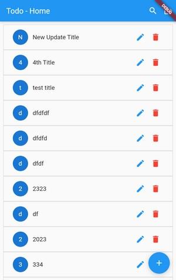

# Laravel_Flutter_Todo_App - Flutter 3 Project

This is a practice project. A Flutter Todo App developed by using Api. 
Backend: Laravel 10 and Frontend: Flutter 3.
I developed REST API in Laravel 10 for authentication, crud and query and then handle those API requests from Flutter 3. 

## Instruction:
<ul>
    <li>1. Creating a Database 'lf_todo_app' in your database server</li>
    <li>2. Goto the 'backend' folder in the terminal.</li>
    <li>3. composer update</li>
    <li>4. 'npm install' and then 'npm run dev'</li>
    <li>5. copy the file .env.example from 'backend' folder and rename into .env, then give information of database, server and create app key by 'php artisan key:gen' the save the file</li>
    <li>6. php artisan migrate</li>
    <li>7. php artisan serve</li> 
    <li>8. Goto the 'frontend_mobile' folder in the terminal.</li>
    <li>9. creating .env and .env.dev files in the 'frontend_mobile' folder and also change 'API_PROJECT_HOST' information from .env and.env.dev.</li>
    <li>10. flutter clean</li>
    <li>11. flutter pub get</li>
    <li>12. flutter run</li>
</ul>

### Features:

<ul>
    <li>1. Authentication (Register, Login and Logout).</li>
    <li>2. CRUD (Create, Read, Update and Delete Todo.)</li>
    <li>3. Query (Search data from todo).</li>
    <li>4. Click any list item to show details in a new page (send data from one page to another page).</li>
    <li>5. Store token in the device after login. So, no need to login again.</li>
</ul>

### Database that must obey:

The work of the database must be done through migrate, but it cannot be directly modified by going to the database from database server.

### Extra Packages used:
 
<ul>
  <li>1. flutter_screenutil: ^5.9.0 - for responsie app design.</li>
  <li>2. flutter_dotenv: ^5.1.0 - for global environment variables.</li>
  <li>3. http: ^1.1.0 - for http requests to handle api request.</li>
  <li>4. shared_preferences: ^2.2.2 - for storing logn token in device.</li>
</ul>

### Requires Android:

Minimum SDK Version: 21 (Android 5.0 or, Lollipop) and Target SDK Version: 34 (Android 14)

### Tested On:

- Google Chrome

### Used Tools:

Laravel v10.11.0 and Flutter 3.13.2. 

### Project Version:

version: 1.0.0 (01-Dec-2023)  
(When I will make change something from 'laravel_flutter_todo_app' folder.)

### Flutter App Version:
version: 1.0.0 (01-Dec-2023)  
(When I will make change something only from 'frontend_mobile' folder. This information has been taken from 'pubspec.yaml' file of flutter project.)

### App size:

00.00 MB (After build on APK for all platform)  
00.00 MB (After build on APK for specific platform)

### Start Date:

01-Dec-2023

### Last Update:

01-Dec-2023

### Developed by:

Md. Rezwan Saki Alin
https://www.alinsworld.com/

## License

The Laravel framework is open-sourced software licensed under the [MIT license](https://opensource.org/licenses/MIT).

Flutter is an open source framework by Google.

